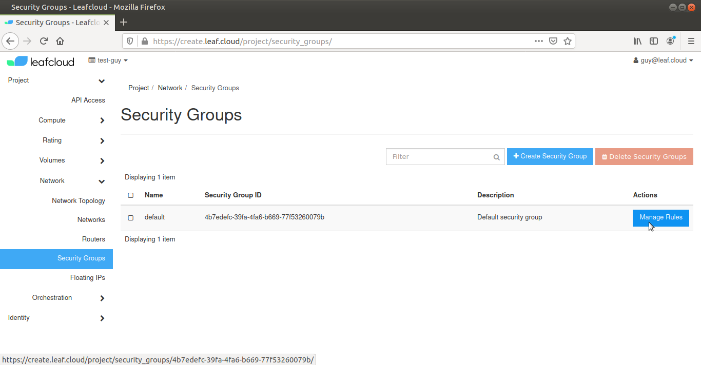
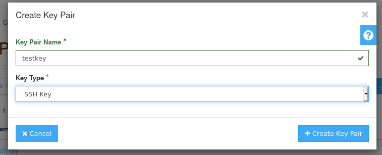

# Configuring secure access

This tutorial will walk you through Security Groups, IP rules, and Key Pairs that will allow you to grant SSH access to your virtual machine, or *instance*

## Security Groups

Configuring your security groups allows you to determine what traffic can access which port on your instance

### Enabling SSH and ICMP

In this tutorial we will add rules to the existing *Default security group* that will enable SSH and ICMP access to your instance

Navigate to *Project > Network*, then click on *Security Groups*

The available security groups for this project are now displayed, select the group with the *Default security group* description and click *Manage Rules* on the right

Click on *Add Rule*

Select *SSH* from the Rule dropdown list, make sure the Remote is set to *CIDR* and fill in *0.0.0.0/0*

Click *Add*

You have now added a rule to the Security Group

click *Add Rule* again

Select *All ICMP* from the Rule dropdown list 

Make sure the *Direction* is set to *Ingress*, the *Remote* is set to *CIDR* and fill in *0.0.0.0/0*

click *Add*

You can now access your instance by SSH and ICMP

## Key Pairs

Key pairs consist of two keys: a 'public' and a 'private' key, these ensure that traffic to and from your instance is encrypted through SSH. You can use a single key pair for multiple instances concurrently

### Making a new key pair

Navigate to *Compute > Key Pairs*

Click on *Create Key Pair*

Give your new key a name and select *SSH* from the *Key Type* dropdown list. For our example, we'll use an SSH type

Click on *Save Key Pair* and save your key in a secure location on your device

You have now created a new Key Pair

### Using an existing pair

Navigate to *Compute > Key Pairs*

Click on *Import Public Key*

Give your key a name and select the type from the dropdown menu, then click on *Choose File* and open the key file you wish to use

Click on *Import Public Key*

You have now imported your existing key