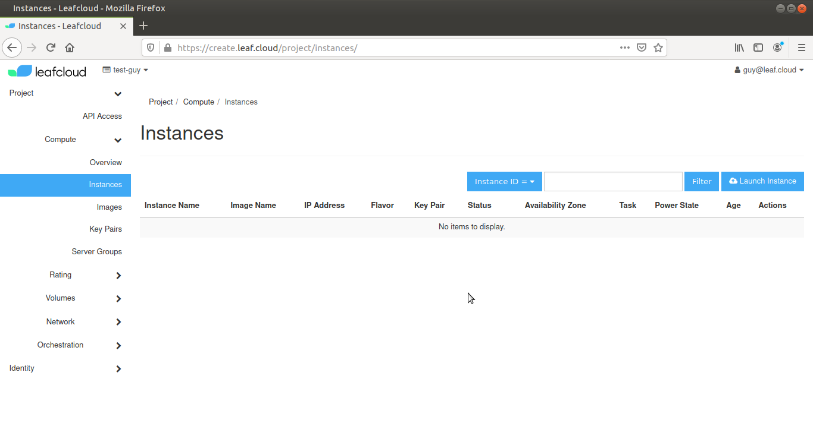
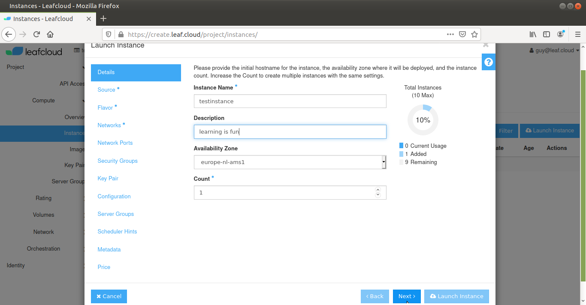
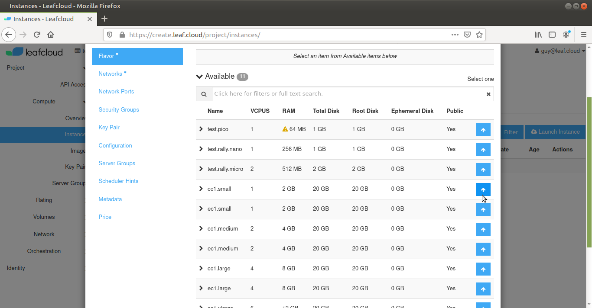
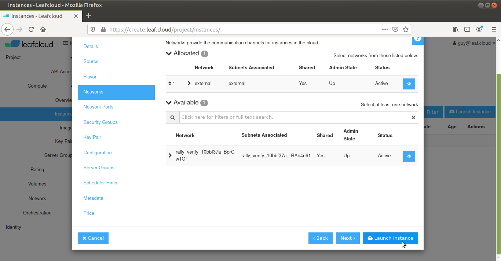

# How to launch an instance

In this tutorial we'll work through setting up a Leafcloud instance 

Navigate to *Compute*, then click on *Instances*

Click on *Launch Instance*, on the center right

### Details

Give your instance a unique name (ie. testinstance) and add a description.

The *Availability Zone* is where the instance will be deployed, the *Count* setting allows you to create multiple instances with the same settings, for the purpose of this tutorial make sure it is set to 1

Click on *next*

### Source

In this tutorial we will create a new volume and boot from a specific image. For booting from an existing volume or an instance snaphot, see the related tutorials

Make sure your settings are as follows:

Boot Source: Image, check to make sure that *Create New Volume* is selected

Volume Size: 1GiB, check if *Delete Volume on Instance Delete* is **not** selected

Select *Cirros 0.5.1* by clicking the up arrow on the right (this image does not need a key pair)

Click on *next*

### Flavor

This is the type of server used to host your instance. 

Select *ec1.small*, by clicking on the up arrow on the right. These *ec* sites are servers located at one of our Leaf-sites, where server heat is re-used locally

Click *next*

### Networks

Here you can determine on which channels the instance will be reachable

Select *external*, this gives your instance a public IP address

Click *Launch Instance* at the bottom of the frame, you have now started your instance

